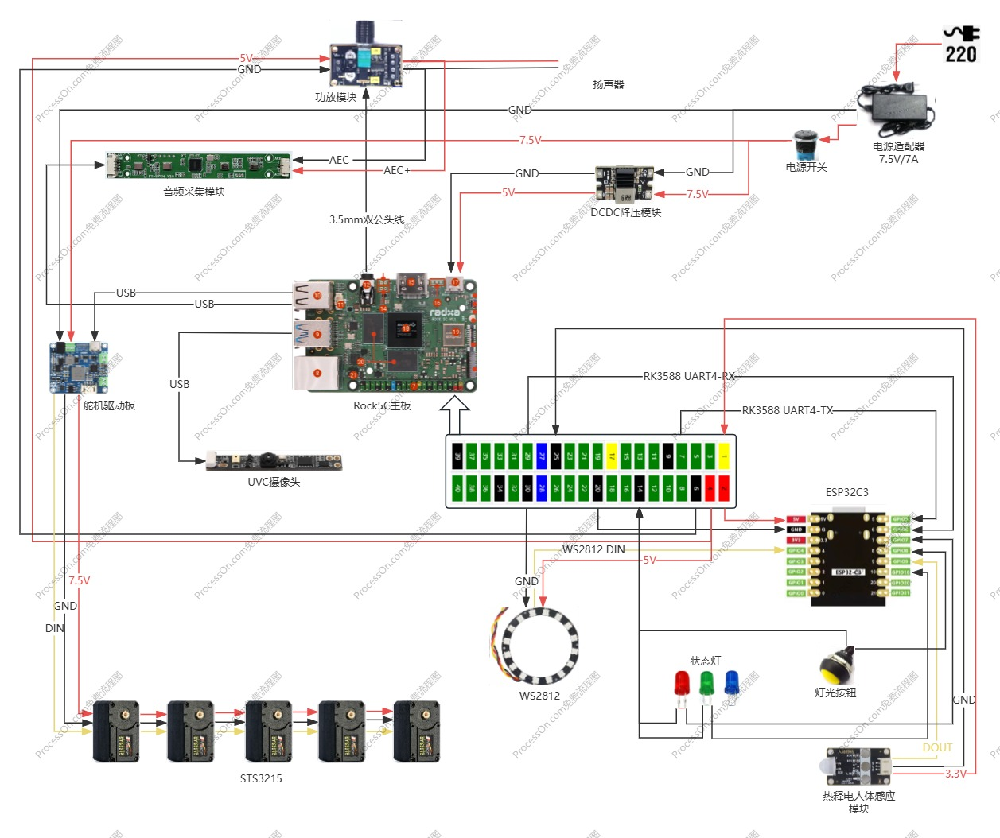

# Lamp Runtime

DOIT AI Desk Lamp is an open-source project based on [LeLamp](https://github.com/humancomputerlab/LeLamp). It enhances the visual capabilities by fixing the low frame rate issue of the UVC camera in the original hardware design, and modifies the audio input/output circuitry while adding a physical volume control knob. On the software side, it integrates the Chinese GLM large language model.

## Overview

The project software is developed based on Python, and the hardware resources include the following parts:

* Feetech STS3215 servos (5 servos)
* Audio expansion board
* WS2812 LED panel
* UVC camera module
* Main control board (supports: Radxa Rock 5C, Raspberry Pi Zero 2W/3B/4B/5)
* DC-DC buck converter
* Servo driver board
* Power amplifier module

 
  

## Hardware

### Schematic
The lamp uses the Radxa Rock 5C (RK3588 inside) as its main control board, and is also compatible with Raspberry Pi solutions. It supports deploying self-trained small models for customized machine learning skills, and can connect to big model platforms (GLM model) over the network to enable general-purpose AI conversation capabilities.

### Why I use ESP32

The device uses an ESP32-C3 module to control various peripherals, while the main control board is only responsible for big model access and the inference and execution of small models. The main control board communicates with the ESP32 via UART using a custom protocol, indirectly achieving control over the peripherals. This approach, on one hand, decouples the software, avoiding the need to rewrite peripheral drivers when using different SoC; on the other hand, it isolates the main control and peripheral circuits at the hardware level, making debugging easier and avoiding interference.

## Get started

By following the documentation below, you can achieve an AI lamp.

- [Hardware assemble](./doc/assemble.md)
- [Calibrate servo](./doc/calibrate.md)
- [Software setup](./doc/setup.md)
- [Unit test](./doc/unittest.md)
- [AI skill](./doc/skill.md)