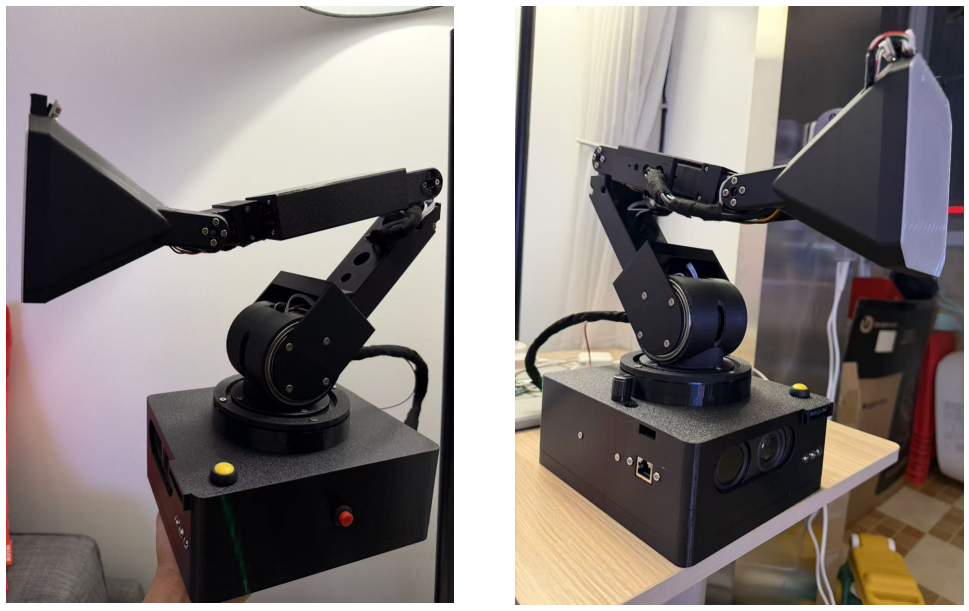

# Lamp Runtime

DOIT AI Desk Lamp is an open-source project based on [LeLamp](https://github.com/humancomputerlab/LeLamp). It enhances the visual capabilities by fixing the low frame rate issue of the UVC camera in the original hardware design, and modifies the audio input/output circuitry while adding a physical volume control knob. On the software side, it integrates the Chinese GLM large language model.

## Overview

The project software is developed based on Python, and the hardware resources include the following parts:

* Feetech STS3215 servos (5 servos)
* Audio expansion board
* WS2812 LED panel
* UVC camera module
* Main control board (supports: Radxa Rock 5C, Raspberry Pi Zero 2W/3B/4B/5)
* DC-DC buck converter
* Servo driver board
* Power amplifier module

 
  

## Get started

- [Hardware assemble](./doc/assemble.md)
- [Software setup](./doc/setup.md)
- [Unit test](./doc/unittest.md)
- [AI skill](./doc/skill.md)